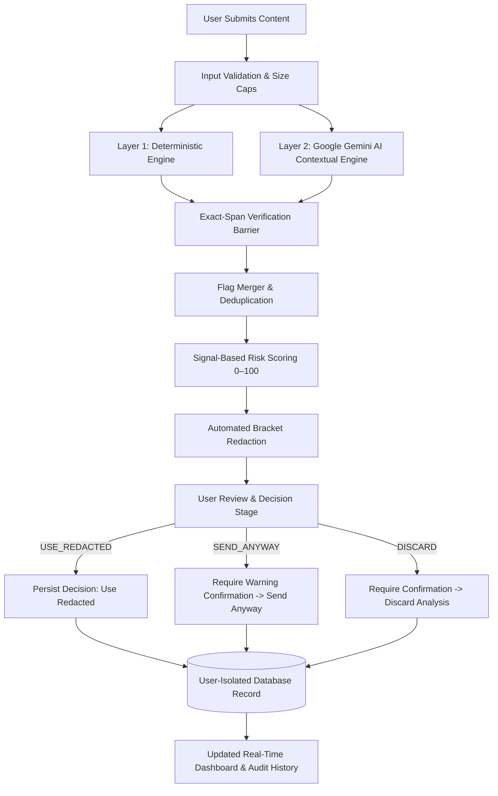
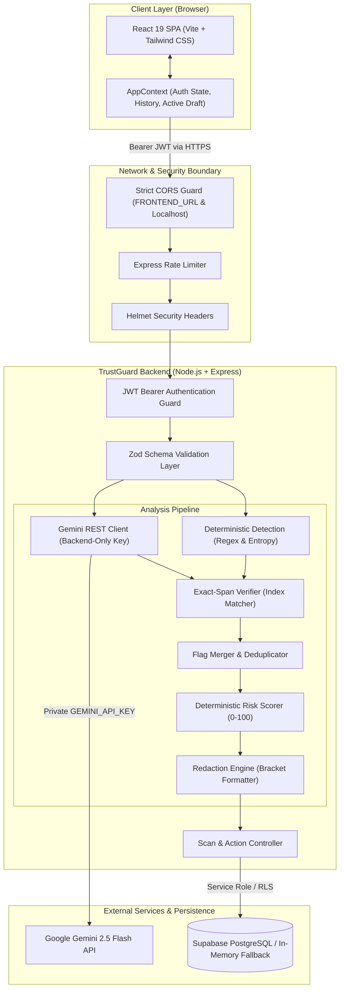

# 🛡️ TrustGuard AI

> **"Your last security check before you send."**

TrustGuard AI is an AI-powered security and privacy checkpoint that analyzes content before it is sent, submitted, or shared. It identifies sensitive information and social-engineering signals, explains why the content may be risky, generates a safer redacted version, and records the user's security decision in an audit log.

[](https://trust-guard-silk.vercel.app)
[](https://trustguard-aads.onrender.com/api/health)
[](LICENSE)
[](https://nodejs.org/)
[](https://ai.google.dev/)
[](https://supabase.com/)

---

## 📋 Table of Contents

- [Hackathon Overview](#-hackathon-overview)
- [Project Overview & Core Pillars](#-project-overview--core-pillars)
- [The Problem](#-the-problem)
- [The Solution](#-the-solution)
- [Core Features](#-core-features)
- [Why Exact-Span Verification Matters](#-why-exact-span-verification-matters)
- [Technical Architecture](#-technical-architecture)
- [AI Architecture & Pipeline](#-ai-architecture--pipeline)
- [Security Architecture](#-security-architecture)
- [Privacy & Data Handling](#-privacy--data-handling)
- [Detection & Redaction Pipeline](#-detection--redaction-pipeline)
- [User Workflow](#-user-workflow)
- [Technology Stack](#-technology-stack)
- [Database Schema](#-database-schema)
- [REST API Reference](#-rest-api-reference)
- [Project Structure](#-project-structure)
- [Local Development Setup](#-local-development-setup)
- [Environment Configuration](#-environment-configuration)
- [Testing & Quality Assurance](#-testing--quality-assurance)
- [Live Deployment](#-live-deployment)
- [Hackathon Demo Flow](#-hackathon-demo-flow)
- [Current Limitations & Roadmap](#-current-limitations--roadmap)
- [Hackathon Positioning](#-hackathon-positioning)
- [Team](#-team)
- [License](#-license)

---

## 🏆 Hackathon Overview

* **Project:** TrustGuard AI
* **Theme:** AI Security, Privacy & Trust
* **Repository:** [https://github.com/pranaykhodade1922-dot/TrustGuard.git](https://github.com/pranaykhodade1922-dot/TrustGuard.git)
* **Live Application:** [https://trust-guard-silk.vercel.app](https://trust-guard-silk.vercel.app)
* **Backend Health Probe:** [https://trustguard-aads.onrender.com/api/health](https://trustguard-aads.onrender.com/api/health)
* **Video Recording:** [Google Drive Video](https://drive.google.com/drive/folders/1EiAuHOFaThqicXuWR0g2okR07aT9GQ0b?usp=sharing)
* **Team:**
  1. **Pranay Khodade**
  2. **Suraj Khanse**
  3. **Sumit Jagtap**

---

## 💡 Project Overview & Core Pillars

TrustGuard AI serves as the user's final security checkpoint before information leaves their control. Whether drafting an email, communicating in customer support, or submitting a prompt to a public Large Language Model, TrustGuard inspects the draft text for critical vulnerabilities.

> **"TrustGuard doesn't just say that something is risky. It shows exactly what is risky, why it is risky, what can be protected, and what decision was made."**

The platform is anchored around four foundational pillars:

```
┌─────────────────┐     ┌─────────────────┐     ┌─────────────────┐     ┌─────────────────┐
│     DETECT      │ ──> │     EXPLAIN     │ ──> │     PROTECT     │ ──> │      PROVE      │
│ Deterministic & │     │ Exact span &    │     │ Automated safe  │     │ User-scoped     │
│ AI Intelligence │     │ plain-language  │     │ non-destructive │     │ decision audit  │
│ pattern scan    │     │ threat reasons  │     │ redactions      │     │ trail log       │
└─────────────────┘     └─────────────────┘     └─────────────────┘     └─────────────────┘
```

1. **DETECT:** Identifies personally identifiable information (PII), exposed credentials, API secrets, financial numbers, and subtle social-engineering signals.
2. **EXPLAIN:** Pinpoints the exact flagged text span and provides a human-readable, context-aware explanation of why it presents a risk.
3. **PROTECT:** Automatically generates a safe, bracket-redacted version of the text that preserves sentence structure and utility.
4. **PROVE:** Maintains an immutable, user-isolated audit record storing the risk score, findings, and the explicit action taken by the user.

---

## ⚠️ The Problem

Every day, developers, executives, healthcare professionals, and employees inadvertently paste or send confidential content into external platforms:

* **Accidental Credential Exposure:** Cloud access keys (AWS, Google, GitHub tokens), database connection URIs, and private RSA keys copied into support tickets or public LLM chats.
* **PII & Regulatory Non-Compliance:** Customer email addresses, personal phone numbers, and national identifiers (SSN, Aadhaar, PAN) leaked in unredacted emails and attachments.
* **Financial Fraud Risks:** Corporate credit card numbers, IBANs, and wire transfer instructions exposed without verification.
* **Social Engineering Manipulation:** Sophisticated phishing drafts employing artificial urgency, coercive executive impersonation, and fraudulent banking diversion requests.

**The core issue:** The security breakdown occurs **immediately before** information leaves the user's custody. Once submitted to an untrusted external server or public AI, the data cannot be revoked.

---

## 🎯 The Solution

TrustGuard AI provides a client-side checkpoint backed by an isolated security backend. The workflow operates as follows:



1. **Validation:** Checks content size (up to 100,000 characters) and strips malicious payloads.
2. **Deterministic Scan:** Runs immediate regex and entropy checks across high-severity known secret formats and PII structures.
3. **AI Contextual Analysis:** Prompts Google Gemini 2.5 Flash on the backend to detect semantic threats, coercion, and impersonation.
4. **Exact-Span Verification:** Cross-checks every AI-reported finding against the original input. Hallucinated tokens that do not appear verbatim are discarded.
5. **Risk Scoring:** Assigns an objective 0–100 score and assigns a risk tier (`LOW`, `MEDIUM`, `HIGH`, `CRITICAL`).
6. **Redaction:** Replaces sensitive spans with structured placeholders (`[REDACTED_CREDENTIAL]`, `[REDACTED_PII]`, etc.).
7. **User Decision:** Enforces one of three explicit user actions (`USE_REDACTED`, `SEND_ANYWAY`, `DISCARD`).
8. **Audit Trail:** Persists the check, findings, and decision in a PostgreSQL database locked to the user's JWT ID.

---

## ⚡ Core Features

| Feature | Status | Description |
| :--- | :---: | :--- |
| **JWT Authentication** | ✅ Implemented | Secure sign-up and sign-in issuing 7-day signed JWT tokens with bcrypt password hashing (10 salt rounds). |
| **Deterministic Detection** | ✅ Implemented | Rule-based engine scanning for AWS keys, Google API keys, GitHub tokens, Slack tokens, private keys, credit cards, phones, and emails. |
| **Gemini AI Contextual Engine** | ✅ Implemented | Google Gemini 2.5 Flash integration inspecting intent, coercion, phishing lures, and deceptive requests. |
| **Exact-Span Verification** | ✅ Implemented | Hallucination barrier ensuring every finding maps character-for-character to the submitted text. |
| **0–100 Risk Scorer** | ✅ Implemented | Deterministic, weighted scoring engine mapping to `LOW` (<20), `MEDIUM` (20–54), `HIGH` (55–79), and `CRITICAL` (80–100). |
| **Transparent Threat Explanations** | ✅ Implemented | Human-readable explanation for each detected item explaining the exact risk consequence. |
| **Non-Destructive Redaction** | ✅ Implemented | Replaces flagged spans with formatted tokens with one-click clipboard copying of protected text. |
| **Three PRD Decision Actions** | ✅ Implemented | Full support for `USE_REDACTED`, `SEND_ANYWAY` (with warning modal), and `DISCARD` (with audit preservation). |
| **User Data Isolation** | ✅ Implemented | Database queries enforce `user_id === req.user.id`. Cross-user access returns HTTP `404 Not Found`. |
| **Live User Dashboard** | ✅ Implemented | Real-time aggregate metrics calculating Total Checks, High Risk Checks, Protected Checks, and Discarded Checks. |
| **Auditable Scan History** | ✅ Implemented | Searchable and filterable history table displaying full dates, risk scores, finding counts, and action badges. |
| **Database-Driven Scan Details** | ✅ Implemented | Dedicated `/app/scan/:id` route showing verified flags, security score, why it's risky, and masked original input. |
| **Rate Limiting & Helmet** | ✅ Implemented | HTTP security headers and IP rate limiting (100 req/15 min API, 20 req/15 min auth endpoints). |

---

## 🔍 Why Exact-Span Verification Matters

A critical failure of AI-driven security tools is **hallucination**: LLMs frequently paraphrase, alter characters, or report vulnerabilities that do not actually exist in the prompt.

TrustGuard AI solves this with a strict **Exact-Span Verification Layer**:

```text
Original Content: "Contact me at security@trustguard.dev with token secret_token_xyz9876."
                                      │
AI Model Output:                     ▼
[
  { "span": "security@trustguard.dev", "category": "PII" },       ──> Verbatim match found at index 14  --> [ACCEPTED]
  { "span": "admin@trustguard.dev",    "category": "PII" },       ──> NOT found in original content    --> [DISCARDED]
  { "span": "secret_token_xyz9876",    "category": "CREDENTIAL" } ──> Verbatim match found at index 53  --> [ACCEPTED]
]
```

### Why this is critical:
* **Reliability:** Prevents false alarms and ensures that users never see flags for content they did not write.
* **Explainability:** Guarantees that every finding highlighted in the UI can be mapped to its exact starting and ending coordinates.
* **Safe Redaction:** Prevents the redaction engine from corrupting unflagged text. Redactions only overwrite verified indices.
* **Transparency:** Users can inspect the exact substring that caused the risk score to elevate.

*(Note: Exact-span verification guarantees that every accepted finding exists verbatim in the text; it serves as a strict guardrail against hallucinated spans.)*

---

## 🏛️ Technical Architecture

TrustGuard AI enforces a **zero-leakage architecture** where sensitive API keys and database credentials reside exclusively on the backend server.



---

## 🧠 AI Architecture & Pipeline

* **AI Provider:** Google Gemini 2.5 Flash (`models/gemini-2.5-flash`)
* **Call Mechanism:** Native HTTPS REST call using Node.js `fetch` (zero heavy external SDK bloat).
* **Key Security:** The `GEMINI_API_KEY` is loaded exclusively into backend memory via `process.env.GEMINI_API_KEY`. It is **never** accessible to the frontend, Vite client environment, or browser storage.

### Structured Output Schema
The backend instructs Gemini to return strict JSON matching this structure:

```json
{
  "riskScore": 75,
  "flags": [
    {
      "span": "sk-live-abc123xyz456",
      "category": "CREDENTIAL",
      "reason": "Exposes an active live API token that could allow unauthorized administrative access."
    },
    {
      "span": "pranay@trustguard.dev",
      "category": "PII",
      "reason": "Direct email address identifying an individual."
    }
  ]
}
```

### Prompt Engineering Guardrails:
* Directs Gemini to extract **exact character-for-character substrings** from the input without modification.
* Categorizes threats strictly into: `CREDENTIAL`, `FINANCIAL`, `PII`, `SOCIAL_ENGINEERING`.
* Evaluates context (e.g., distinguishing between a generic sample and an urgent phishing lure requesting money).

---

## 🔒 Security Architecture

TrustGuard is built upon a defense-in-depth model:

1. **Authentication:**
   * Custom bcrypt password hashing with 10 salt rounds.
   * Signed JSON Web Tokens (JWT) using HMAC-SHA256 with 7-day expiration.
2. **Backend-Derived User Identity:**
   * **The frontend is never trusted to provide a `user_id`.**
   * Identity is extracted strictly from verified JWT claims (`req.user.id`).
   * Attempting to query or update a scan belonging to another user results in HTTP `404 Not Found` (preventing user enumeration).
3. **CORS Normalization:**
   * Strict origin matching supporting exact production domains (`https://trust-guard-silk.vercel.app`) and local development (`http://localhost:5173`).
   * Automatically normalizes trailing slashes to prevent cross-origin preflight drops.
   * No wildcard origins (`*`) are used.
4. **Input & Payload Validation:**
   * Strict Zod schemas on all endpoints (`auth.schema.js`, `scan.routes.js`).
   * Action updates reject arbitrary payloads and accept only: `USE_REDACTED`, `SEND_ANYWAY`, `DISCARD`.
5. **Security Headers & Abuse Prevention:**
   * Helmet protects against clickjacking, MIME-sniffing, and XSS.
   * Rate limiting stops brute-force login attempts and API abuse.

---

## 🛡️ Privacy & Data Handling

TrustGuard takes a realistic and transparent approach to data privacy:

| Data Type | Storage Location | Retention & Privacy Details |
| :--- | :--- | :--- |
| **User Credentials** | `public.users` table | Password is stored **only** as a one-way bcrypt hash. Plaintext passwords are never logged or stored. |
| **Raw Input Content** | `public.scans.input_text` | Stored in the authenticated user's scan record for historical audit purposes. Accessible **only** by the owner. |
| **Redacted Content** | `public.scans.redacted_text` | Stored alongside the scan for instant copying and remediation review. |
| **Flags & Findings** | `public.scans.flags` (JSONB) | Contains verified flagged spans, categories, and justifications. |
| **Audit Decision** | `public.scans.action_taken` | Persists `USE_REDACTED`, `SEND_ANYWAY`, or `DISCARD` for compliance tracking. |
| **Third-Party Transmission** | Google Gemini API | Only text analyzed via the AI layer is sent to Google's API via encrypted HTTPS. |

### Privacy Controls in UI:
* **Default Masking:** On the Scan Detail page, raw `input_text` is hidden behind an explicit "View Original" toggle with privacy warnings to prevent accidental over-the-shoulder exposure.
* **User Isolation:** All records are segregated by UUID foreign keys backed by PostgreSQL Row Level Security (RLS).

---

## ⚙️ Detection & Redaction Pipeline

The core analysis pipeline combines deterministic rules and contextual AI:

```
Raw Input Text
      │
      ├──> [Deterministic Scanner] ──> AWS keys, Google API keys, GitHub tokens, Slack tokens,
      │                                Private Keys, Credit Cards (Luhn), Emails, Phones, Aadhaar
      │
      └──> [Gemini 2.5 Flash]      ──> Coercion, Urgency, Authority Impersonation, Social Eng.
                                                │
                                                ▼
                                    [Exact-Span Verifier]
                                    Validates that span exists verbatim in input text
                                                │
                                                ▼
                                    [Flag Merger & Deduplicator]
                                    Combines findings and eliminates overlapping ranges
                                                │
                                                ▼
                                    [Risk Scorer (0–100)]
                                    Computes signal weights and assigns risk tier
                                                │
                                                ▼
                                    [Redaction Engine]
                                    Injects bracket tokens: [REDACTED_CREDENTIAL], [REDACTED_PII]
```

### Risk Scoring Formula:
* `CREDENTIAL`: +50 per finding
* `FINANCIAL`: +40 per finding
* `SOCIAL_ENGINEERING`: +35 per finding
* `PII` (National Identifiers): +35 per finding
* `PII` (Standard Contact): +15 per finding
* `Multi-Vector Threat Synergy`: +15 extra if Social Engineering is combined with Credentials or Financial requests.
* Total score capped at **100**.

---

## 🔄 User Workflow

```
1. Authenticate   ──>   2. Submit Content   ──>   3. Automated Scan   ──>   4. Review Findings
   Sign up or            Paste draft text          Deterministic & AI          Inspect risk score,
   log in with           or upload file            analysis pipeline           findings & spans
   JWT session           into editor               executes in seconds         with plain explanations
                                                                                      │
                                                                                      ▼
7. History & Audit  <──  6. Enforce Decision  <──  5. Review Redaction <──────────────┘
   Inspect past          Choose: USE_REDACTED      Compare original vs.
   checks and actions    SEND_ANYWAY (warning)     protected text; copy
   on dashboard          or DISCARD                redacted draft in 1 click
```

1. **Authenticate:** User registers or logs in at `/login` or `/signup`. A secure JWT token is saved locally.
2. **Submit Content:** User navigates to `/app/analyze`, pasting text, email drafts, or AI prompts, or uploading documents (`.txt`, `.md`, `.json`, `.csv`, `.log`).
3. **Analyze:** Clicking **"Analyze & Protect"** triggers `POST /api/analyze`.
4. **Review Findings:** Inspects the 0–100 risk score, risk level badge, and category breakdown cards.
5. **Remediation Preview:** Reviews side-by-side or protected-only views comparing raw vs. redacted text.
6. **Decision:**
   * **Use Redacted (`USE_REDACTED`):** Records that the user accepted the safe version. Allows immediate clipboard copying.
   * **Send Anyway (`SEND_ANYWAY`):** Opens a warning confirmation modal acknowledging security risks before logging unredacted dispatch.
   * **Discard (`DISCARD`):** Confirms intent to discard the draft while preserving audit integrity.
7. **Audit & Dashboard:** Navigates to `/app/history` or `/app/dashboard` to inspect aggregated risk metrics and past scans.

---

## 💻 Technology Stack

### Frontend
* **Core:** React 19, JavaScript (ES Modules)
* **Build System:** Vite 8.3
* **Styling:** Vanilla CSS, Tailwind-styled components, Responsive Grid Layout
* **Icons:** Lucide React
* **Charts:** Recharts (Area charts for risk trends)
* **Routing:** React Router DOM v7

### Backend
* **Runtime:** Node.js v20+ / v24
* **Framework:** Express 4
* **Security:** Helmet, CORS, Express Rate Limit
* **Validation:** Zod
* **Authentication:** JSON Web Tokens (`jsonwebtoken`), `bcryptjs`
* **Cryptography:** Node.js native `crypto`

### AI & Data
* **AI Provider:** Google Gemini 2.5 Flash via REST API
* **Database:** Supabase PostgreSQL with Row Level Security (RLS)
* **Local Development Fallback:** Built-in in-memory repository with user isolation

---

## 🗄️ Database Schema

Defined in [`backend/database/schema.sql`](backend/database/schema.sql):

```sql
-- 1. USERS TABLE
CREATE TABLE IF NOT EXISTS public.users (
    id UUID PRIMARY KEY DEFAULT gen_random_uuid(),
    email TEXT UNIQUE NOT NULL,
    password_hash TEXT NOT NULL,
    created_at TIMESTAMPTZ NOT NULL DEFAULT NOW()
);

-- 2. SCANS TABLE
CREATE TABLE IF NOT EXISTS public.scans (
    id UUID PRIMARY KEY DEFAULT gen_random_uuid(),
    user_id UUID NOT NULL REFERENCES public.users(id) ON DELETE CASCADE,
    input_text TEXT,
    risk_score INTEGER CHECK (risk_score >= 0 AND risk_score <= 100),
    flags JSONB DEFAULT '[]'::jsonb,
    redacted_text TEXT,
    action_taken TEXT CHECK (action_taken IN (
        'SEND_ANYWAY', 'USE_REDACTED', 'DISCARD', 
        'protected', 'send_anyway', 'discarded', 'reviewed', 'safe'
    )),
    created_at TIMESTAMPTZ NOT NULL DEFAULT NOW()
);

-- Row Level Security (RLS) Policies
ALTER TABLE public.users ENABLE ROW LEVEL SECURITY;
ALTER TABLE public.scans ENABLE ROW LEVEL SECURITY;

CREATE POLICY "Users can read own profile" ON public.users FOR SELECT USING (auth.uid() = id);
CREATE POLICY "Users can view own scans" ON public.scans FOR SELECT USING (auth.uid() = user_id);
CREATE POLICY "Users can insert own scans" ON public.scans FOR INSERT WITH CHECK (auth.uid() = user_id);
```

---

## 📡 REST API Reference

All protected endpoints require the HTTP header:  
`Authorization: Bearer <token>`

| Method | Endpoint | Auth Required | Description |
| :--- | :--- | :---: | :--- |
| `GET` | `/api/health` | No | Health check probing server status and live database connectivity. |
| `POST` | `/api/auth/signup` | No | Register a new user account with email and password. |
| `POST` | `/api/auth/login` | No | Authenticate credentials and receive a signed JWT token. |
| `GET` | `/api/auth/me` | Yes | Get the authenticated user's profile derived from token claims. |
| `POST` | `/api/analyze` | Yes | Run hybrid deterministic + Gemini AI security inspection on submitted text. |
| `GET` | `/api/scans` | Yes | List all scans belonging strictly to the authenticated user. |
| `GET` | `/api/scans/:id` | Yes | Retrieve a single scan by ID with ownership enforcement (404 if unauthorized). |
| `PATCH` | `/api/scans/:id/action` | Yes | Update user action (`SEND_ANYWAY`, `USE_REDACTED`, `DISCARD`). |

---

## 📂 Project Structure

```text
TrustGuard/
├── .env.example                  # Root frontend environment template
├── .gitignore                    # Root gitignore protecting secrets & build artifacts
├── index.html                    # Single Page Application HTML root
├── LICENSE                       # MIT License
├── package.json                  # Frontend dependencies and npm scripts
├── README.md                     # Comprehensive project documentation
├── vite.config.js                # Vite build and development configuration
├── public/                       # Public web assets (favicons, SVG icons)
├── src/                          # Frontend Application Source
│   ├── components/               # Reusable React components
│   │   ├── analysis/             # FindingCard, RedactedPreview, ActionPanel
│   │   ├── common/               # Button, Badge, Modal, Card, RiskBadge
│   │   └── layout/               # Topbar, Sidebar, AppLayout, AuthGuard
│   ├── context/                  # AppContext (global auth, scans, notifications)
│   ├── data/                     # Isolated marketing landing preview fixtures
│   ├── pages/                    # React page views:
│   │   ├── LandingPage.jsx       # Public promotional landing page
│   │   ├── LoginPage.jsx         # Sign-in page
│   │   ├── SignupPage.jsx        # Registration page
│   │   ├── AnalyzePage.jsx       # Security analysis and redaction checkpoint
│   │   ├── ScanDetailsPage.jsx   # Real database-driven scan detail view
│   │   ├── HistoryPage.jsx       # Historical scan audit records table
│   │   ├── DashboardPage.jsx     # Overview metrics and risk trend charts
│   │   └── SettingsPage.jsx      # Preferences and security thresholds
│   └── services/                 # Central API client (api.js)
│
└── backend/                      # Backend Service Application
    ├── .env.example              # Backend environment template
    ├── .gitignore                # Backend gitignore
    ├── package.json              # Backend dependencies and start scripts
    ├── poll-render.mjs           # Render deployment health polling utility
    ├── test-backend.mjs          # Comprehensive backend auth & API unit tests
    ├── test-deployed-live.mjs    # Live CORS and auth verification script
    ├── test-e2e-phase3.mjs       # End-to-end multi-workflow simulation
    ├── test-phase2.mjs           # Phase 2 AI engine test suite
    ├── test-phase3.mjs           # Ownership isolation & Zod validation tests
    ├── verify-audit.mjs          # Security audit test suite
    ├── database/
    │   └── schema.sql            # PostgreSQL schema with RLS policies
    └── src/
        ├── app.js                # Express app, Helmet, CORS, route mounting
        ├── server.js             # HTTP server entrypoint
        ├── config/               # env.js and supabase.js
        ├── controllers/          # auth, analyze, scan controllers
        ├── middleware/           # auth, error, rateLimit, validate middlewares
        ├── routes/               # Express router modules
        ├── schemas/              # Zod validation schemas
        ├── services/             # AI, detection, merger, scorer, redaction, scan services
        └── utils/                # JWT and bcrypt helpers
```

---

## 🚀 Local Development Setup

### 1. Clone the Repository
```bash
git clone https://github.com/pranaykhodade1922-dot/TrustGuard.git
cd TrustGuard
```

### 2. Configure & Run Backend
```bash
cd backend
npm install
cp .env.example .env
```

Configure `backend/.env`:
```env
PORT=5000
NODE_ENV=development
FRONTEND_URL=http://localhost:5173

# Optional: Supabase credentials (in-memory mode activates if unset)
SUPABASE_URL=https://your-project.supabase.co
SUPABASE_SERVICE_ROLE_KEY=your-supabase-service-role-key

# Required: JWT Secret (32+ characters)
JWT_SECRET=your-random-jwt-secret-minimum-32-chars-long
JWT_EXPIRES_IN=7d

# Required: Google Gemini AI Key
GEMINI_API_KEY=your_gemini_api_key_here
GEMINI_MODEL=gemini-2.5-flash
```

Start the backend:
```bash
npm start
```
*Backend active at `http://localhost:5000`.*

### 3. Configure & Run Frontend
In a new terminal, from the project root:
```bash
npm install
cp .env.example .env
```

Ensure `.env` contains:
```env
VITE_API_URL=http://localhost:5000/api
```

Start the Vite development server:
```bash
npm run dev
```
*Frontend active at `http://localhost:5173`.*

---

## 🔧 Environment Configuration

### Frontend (`.env`)
| Variable | Required | Description |
| :--- | :---: | :--- |
| `VITE_API_URL` | Yes | Base URL pointing to the TrustGuard backend API (e.g. `http://localhost:5000/api` or deployed URL). |

### Backend (`backend/.env`)
| Variable | Required | Description |
| :--- | :---: | :--- |
| `PORT` | No | Server port (defaults to `5000`). |
| `NODE_ENV` | Yes | `development` or `production`. |
| `FRONTEND_URL` | Yes | Authorized origin for CORS (e.g. `https://trust-guard-silk.vercel.app` or `http://localhost:5173`). Trailing slashes are automatically normalized. |
| `GEMINI_API_KEY` | Yes | Google Gemini API key used by backend AI analysis. |
| `GEMINI_MODEL` | No | Gemini model identifier (defaults to `gemini-2.5-flash`). |
| `JWT_SECRET` | Yes | 32+ character secret for signing user session tokens. |
| `JWT_EXPIRES_IN` | No | Token lifetime (defaults to `7d`). |
| `SUPABASE_URL` | Optional | Supabase PostgreSQL REST URL. |
| `SUPABASE_SERVICE_ROLE_KEY` | Optional | Supabase service role key for persistent database storage. |

---

## 🧪 Testing & Quality Assurance

TrustGuard includes a robust suite of automated tests verifying security, isolation, and detection accuracy:

```bash
# In the backend directory:
cd backend

# 1. Run Phase 3 Ownership Isolation & Zod Action Validation Suite
node test-phase3.mjs
# -> 23 PASSED, 0 FAILED (Tests cross-user isolation and invalid action rejections)

# 2. Run Full End-to-End Simulation (USE_REDACTED, SEND_ANYWAY, DISCARD)
node test-e2e-phase3.mjs
# -> ALL FLOWS COMPLETED SUCCESSFULLY

# 3. Test Live Deployed CORS and Endpoints
node test-deployed-live.mjs
# -> OPTIONS preflight, signup, and login pass 100% against Render & Vercel
```

Validate frontend production build:
```bash
# In the root directory:
npm run build
# -> Built successfully with zero errors
```

---

## 🌐 Live Deployment

* **Frontend:** Deployed on **Vercel**  
  URL: [https://trust-guard-silk.vercel.app](https://trust-guard-silk.vercel.app)
* **Backend:** Deployed on **Render** (Node.js web service)  
  URL: [https://trustguard-aads.onrender.com](https://trustguard-aads.onrender.com)
* **Live Health Check:**  
  Probe: `GET https://trustguard-aads.onrender.com/api/health`

---

## 🎬 Hackathon Demo Flow

For judges and reviewers evaluating TrustGuard AI:

1. **Visit the Live Application:** Open [https://trust-guard-silk.vercel.app](https://trust-guard-silk.vercel.app).
2. **Review Public Landing:** Notice the product explanation and interactive marketing preview.
3. **Register / Sign In:** Click **"Sign In"** or **"Get Started"** to create a test account (e.g. `judge@hackathon.dev`).
4. **Run a Security Check:**
   * Go to **"Analyze Content"** (`/app/analyze`).
   * Paste a realistic draft containing multiple threat vectors:
     ```text
     URGENT: Wire transfer $45,000 to routing 121000358 before 4 PM or account will be suspended.
     Admin token: sk-live-99a8b7c6d5e4f3g2h1. Contact: pranay@trustguard.dev.
     ```
   * Click **"Analyze & Protect"**.
5. **Inspect Verified Results:**
   * Notice the elevated **Risk Score** (e.g. `85 / 100 — CRITICAL RISK`).
   * Review exact flagged findings for Credential, Financial, PII, and Social Engineering.
   * Review why each item was flagged.
6. **Remediation & Decisions:**
   * Toggle between **Side-by-Side** and **Protected Only** views.
   * Click **"Use Redacted"** — see the action saved and copy the protected text.
   * Click **"Send Anyway"** — observe the warning modal highlighting the risk before confirming.
7. **Verify Audit Trail:**
   * Open **"History"** to see your scan logged with exact date, score, findings count, and action badge.
   * Open **"Dashboard"** to see Total Checks, High Risk Checks, Protected Checks, and Average Risk updated live.

---

## 🔭 Current Limitations & Roadmap

### Current Limitations
* **Input Formats:** Currently accepts plaintext, markdown, JSON, CSV, and logs. Does not yet extract text from scanned PDFs or images via OCR.
* **Storage Retention:** Raw input text is retained in the database alongside scan metadata for audit trails.
* **Language Support:** Optimized primarily for English-language communication and standardized credentials.

### Future Roadmap
- [ ] **Client-Side Envelope Encryption:** Encrypt `input_text` client-side using user-held keys before transmission to the database.
- [ ] **Configurable TTL & Auto-Purge:** Automatic 24h/7d purge schedules for raw input text to support strict zero-retention compliance policies.
- [ ] **Browser Extension Checkpoint:** A Chrome/Firefox extension that automatically intercepts webmail drafts and ChatGPT inputs before submission.
- [ ] **Multi-Model Fallbacks:** Fallback redundancy supporting Anthropic Claude 3.5 Sonnet and OpenAI GPT-4o.
- [ ] **Team & Organization Workspaces:** Role-based access control (RBAC) allowing security teams to aggregate organizational compliance metrics.

---

## 🎯 Hackathon Positioning

Why TrustGuard AI stands out in the **AI Security, Privacy & Trust** theme:

1. **Pre-Dispatch Interception:** Most cybersecurity tools perform post-incident forensics. TrustGuard intervenes **before** data leaves the user's perimeter.
2. **Deterministic + AI Synergy:** Pure regex misses context; pure AI hallucinates. Combining deterministic pattern recognition with Gemini contextual reasoning and exact-span verification creates an accurate, reliable pipeline.
3. **Actionable Governance:** Doesn't just generate a passive score; provides non-destructive remediation and logs human decisions (`USE_REDACTED`, `SEND_ANYWAY`, `DISCARD`) for full compliance accountability.
4. **Production Architecture:** Built with proper authorization isolation, rate limiting, and zero client-side secret leakage.

---

## 👥 Team

Built with pride for the Hackathon by:

* **Pranay Khodade**
* **Suraj Khanse**
* **Sumit Jagtap**

---

## 📄 License

This project is licensed under the [MIT License](LICENSE).
